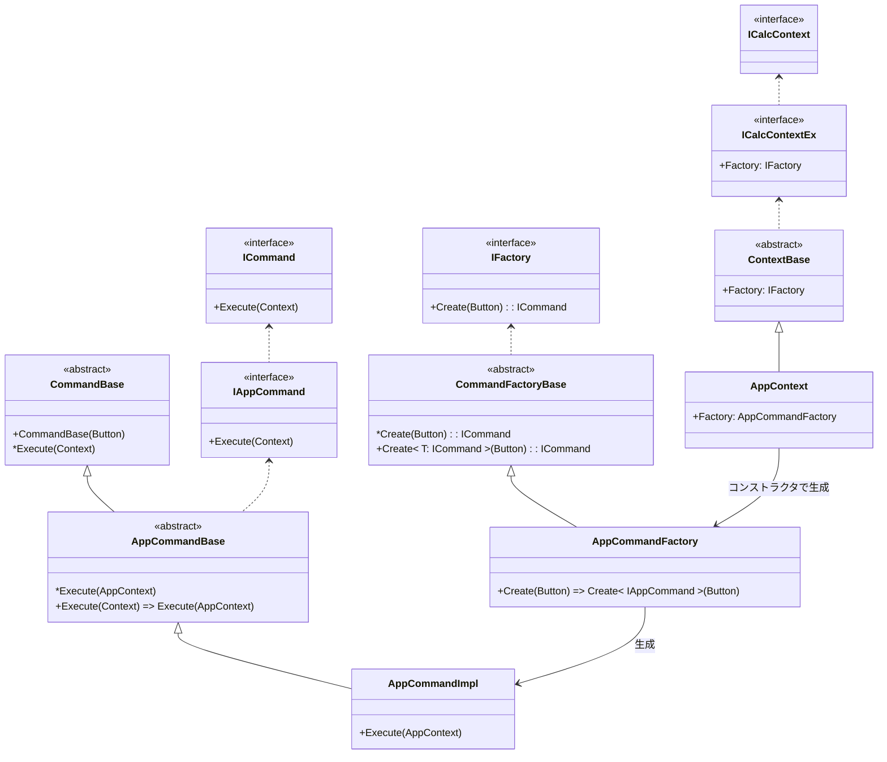

## クラス図

```mermaid

classDiagram

class ICommand {
  <<interface>>
  +Execute(Context)
}

class IAppCommand {
  <<interface>>
  +Execute(Context)
}

class CommandBase{
  <<abstract>>
  +CommandBase(Button)
  *Execute(Context)
}

class AppCommandBase{
  <<abstract>>
  *Execute(AppContext)
  +Execute(Context) => Execute(AppContext)
}

class AppCommandImpl{
  +Execute(AppContext)
}

class IFactory{
  <<interface>>
  +Create(Button): ICommand
}

class CommandFactoryBase{
  <<abstract>>
  *Create(Button): ICommand
  +Create< T: ICommand >(Button): ICommand
}

class AppCommandFactory{
  +Create(Button) => Create< IAppCommand >(Button)
}

class ICalcContext{
  <<interface>>
}

class ICalcContextEx{
  <<interface>>
  +Factory: IFactory
}

class ContextBase{
  <<abstract>>
  +Factory: IFactory
}

class AppContext{
  +Factory: AppCommandFactory
}

ICommand <.. IAppCommand
CommandBase <|-- AppCommandBase
IAppCommand <.. AppCommandBase
AppCommandBase  <|-- AppCommandImpl

IFactory <.. CommandFactoryBase
CommandFactoryBase <|-- AppCommandFactory

AppCommandFactory --> AppCommandImpl : 生成

ICalcContext <.. ICalcContextEx
ICalcContextEx <.. ContextBase
ContextBase <|--  AppContext

AppContext --> AppCommandFactory : コンストラクタで生成
```