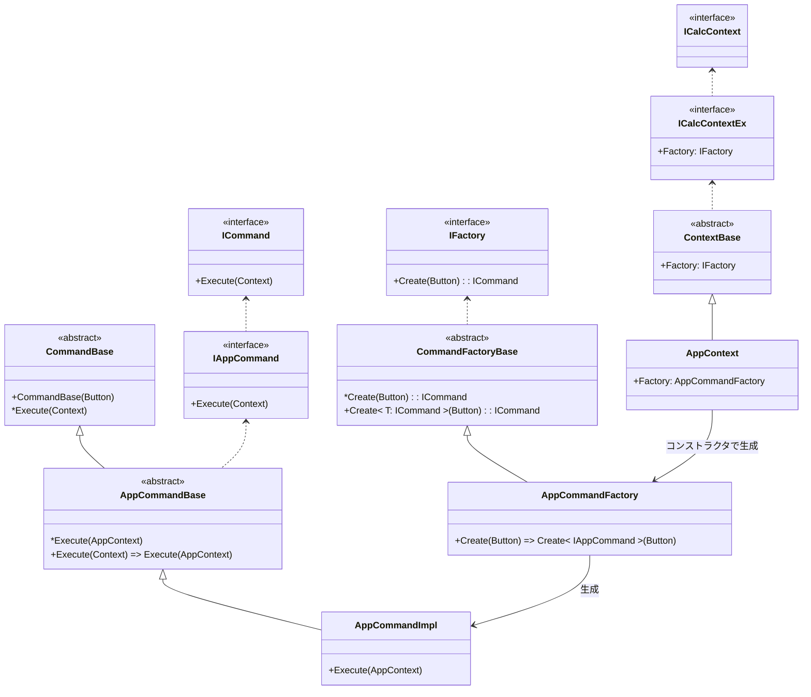

## クラス図

### コンテキストの構成

外部から見える外側のコンテキストと、内部に隠蔽されて電卓の各機能ごとに用意されている内部コンテキストに分かれている

#### 外側のコンテキスト

- アプリ側からはこのコンテキストだけが見えている
- `ICalcContext`で実装するインタフェースは現在アクティブな機能へのデリゲートとして機能する
- 内部コンテキストを変更したり、追加でキーイベントを発生させるような追加機能を持っている
- 俗に言う「シュークリームパターン」っぽい動作をしている

#### 内部コンテキスト

- アプリ側からはこのコンテキストは隠蔽されている
- 電卓機能、おみくじ機能、といった機能ごとに内部コンテキストがあり、状態の保持やディスプレイへの表示内容を担当する
- 自身の機能の中のみがスコープであり、外部コンテキストの操作や他機能のCommandを実行することはできなくなっている

#### DisplayText

`コンテキスト内部に保持しているデータや状態`に応じて出力するようになっている。
後述のCommand等から外部的にディスプレイ内容を直接変更しないようにしている。

### Command

内部コンテキストにFactoryを持たせ、キーを引数にして生成する
Commandはコンテキストの内部データを変更できる